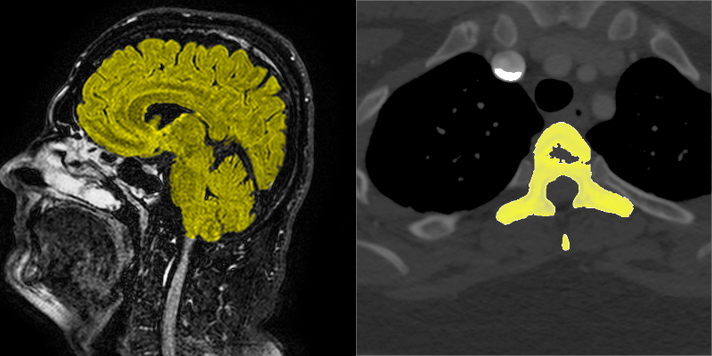
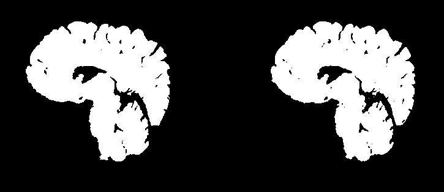

# 3D Dense-U-net for MRI brain tissue segmentation
!!!!! Code is still under development, contains a lot of comments. This will be fixed ASAP after 5. March !!!
This is a repository containing code to Paper 3D Dense-Unet for MRI brain tissue segmentation (that hopefully will be) published on TSP 2018 conference.

The Code is inspired by great repository [Deep Learning Tutorial for Kaggle Ultrasound Nerve Segmentation competition, using Keras](https://github.com/jocicmarko/ultrasound-nerve-segmentation.)

The Dense-Unet architecture was inspired by [The One Hundred Layers Tiramisu: Fully Convolutional DenseNets for Semantic Segmentation](https://arxiv.org/pdf/1611.09326.pdf) and by [Densely Connected Convolutional Networks](https://arxiv.org/pdf/1608.06993.pdf).

The original U-Net architecture was inspired by [U-Net: Convolutional Networks for Biomedical Image Segmentation](http://lmb.informatik.uni-freiburg.de/people/ronneber/u-net/).

## Update 04.04.2018.

Changes:
- added spec file for conda environment
- updated README.md
- cleaned code for clarity
- added testing.py for easier debugging
- added folder structure for code usage

---

## Overview

Figure_1: Example of MRI sagitall brain scan slice - brain tissue segmented with our system is highlighted in yellow.

Figure_2: Dense-U-net network model. Residual interconnections are in green color, dense interconnections in blue.

Figure_3: Example of training and prediction data batch overlapping. Numbers show which slices does each batch contain.

Figure_4: Reference ground truth mask labeled by human expert (left), mask labeled by our system (right).

## About Keras

Keras is a minimalist, highly modular neural networks library, written in Python and capable of running on top of either TensorFlow or Theano. It was developed with a focus on enabling fast experimentation. Being able to go from idea to result with the least possible delay is key to doing good research.

Use Keras if you need a deep learning library that:

allows for easy and fast prototyping (through total modularity, minimalism, and extensibility).
supports both convolutional networks and recurrent networks, as well as combinations of the two.
supports arbitrary connectivity schemes (including multi-input and multi-output training).
runs seamlessly on CPU and GPU.
Read the documentation [Keras.io](http://keras.io/)

Keras is compatible with: Python 2.7-3.5.
